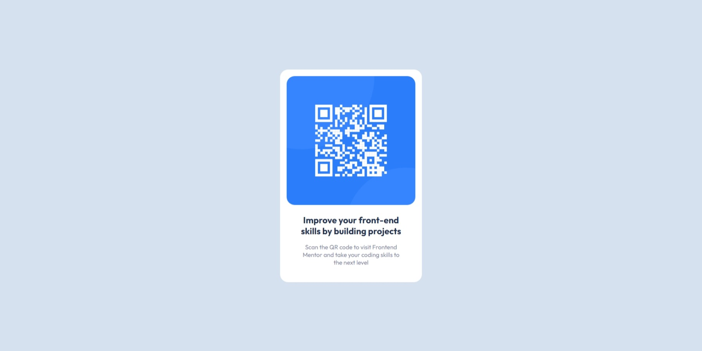

# Frontend Mentor - QR code component solution

This is a solution to the [QR code component challenge on Frontend Mentor](https://www.frontendmentor.io/challenges/qr-code-component-iux_sIO_H). Frontend Mentor challenges help you improve your coding skills by building realistic projects.

## Table of contents

- [Overview](#overview)
  - [Screenshot](#screenshot)
  - [Links](#links)
- [My process](#my-process)
  - [Built with](#built-with)
  - [Continued development](#continued-development)
- [Author](#author)

## Overview

### Screenshot

### Links

- [Solution](https://www.frontendmentor.io/solutions/qr-code-component-react-typescript-jZ-LSxp1pt)
- [Live site](https://yiaoma.github.io/qr-code-component/)

## My process

### Built with

- Semantic HTML5 markup
- CSS custom properties
- Flexbox
- Mobile-first workflow
- [TypeScript](https://www.typescriptlang.org/) - strict syntactical superset of JavaScript
- [React](https://reactjs.org/) - JS library
- [Styled Components](https://styled-components.com/) - For styles

### Continued development

In future development I would like to learn more about CSS Grid, TypeScript, Theming and Custom Hooks.

## Author

- Frontend Mentor - [@Yiaoma](https://www.frontendmentor.io/profile/Yiaoma)
